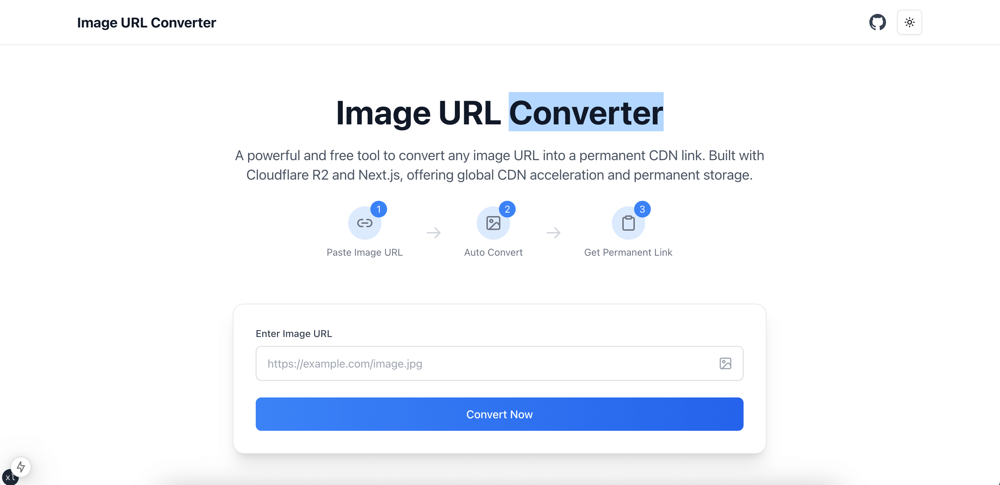
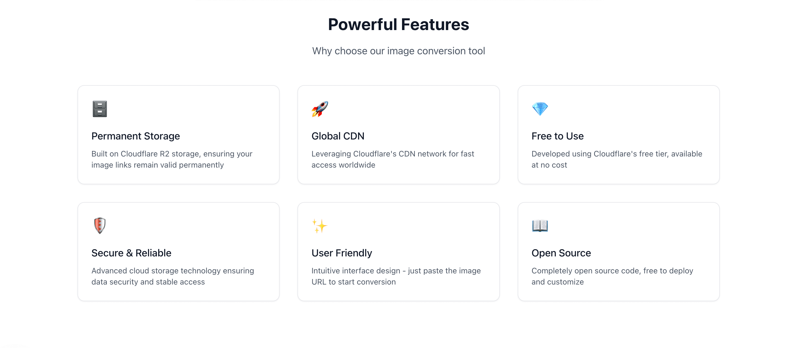

# Image URL Converter

A simple tool that converts any image URL into a permanent link hosted on Cloudflare R2. Perfect for individuals or small projects needing image hosting services.

## Project Structure

```
/image-url-converter
  ├── /image-converter-next     # Next.js frontend project
  └── /image-converter-worker   # Cloudflare Worker project
```



## Features

- Easy to use: Simply input the original image URL to get a permanent link
- Global acceleration: Fast access via Cloudflare CDN
- Free to use: Leverages Cloudflare R2's free tier
  - 10GB storage per month
  - 10GB egress traffic per month
- Custom domain support
- Free deployment



## Setup Guide

### 1. Prerequisites

1. Sign up for a [Cloudflare](https://dash.cloudflare.com/sign-up) account
2. Install [Node.js](https://nodejs.org/) (version 18.0.0 or higher)
3. Install [pnpm](https://pnpm.io/)

### 2. Configure Cloudflare R2

1. Log in to the [Cloudflare Dashboard](https://dash.cloudflare.com)
2. Find and click "R2" in the left sidebar
3. If it's your first time, you'll be prompted to create a billing account (it's free)
4. Click "Create bucket"
   - Set Bucket name to: `images` (or any name you prefer)
   - Click "Create bucket" to finish
5. Click on your newly created bucket in the bucket list
6. Go to the "Settings" tab
7. Find the "Public access" section
   - Enable the "Public bucket" toggle
   - If you have your own domain, you can set up a custom domain below (e.g., images.your-domain.com)
   - If not, copy the "Public bucket URL" for later use
8. Create an API token
   - Click "Manage R2 API Tokens" in the top right
   - Click "Create API token"
   - Select Object Read & Write permissions
   - Click "Create token"
   - Save the following information:
     * Access Key ID
     * Secret Access Key

Note: The Secret Access Key is shown only once, make sure to save it!

### 3. Local Setup

1. [Fork](https://github.com/weijunext/image-url-converter/fork) this project to your GitHub account and clone it locally

```bash
git clone [repository-url]
cd image-url-converter
```

### 4. Configure and Run the Worker

```bash
# Navigate to the Worker project directory
cd image-converter-worker

# Install dependencies
npm install

# Install wrangler
npm install -g wrangler

# Login to Cloudflare
wrangler login

# Deploy the Worker
wrangler deploy
```

### 5. Configure and Run the Next.js App

```bash
# Return to project root
cd ..

# Navigate to Next.js project directory
cd image-converter-next

# Install dependencies
npm install

# Create environment variables file
cp .env.example .env.local
```

Edit `.env.local` with your details:
```
R2_ACCOUNT_ID=Your Cloudflare Account ID (found on the right side of Cloudflare dashboard)
R2_ACCESS_KEY_ID=Your R2 Access Key ID
R2_SECRET_ACCESS_KEY=Your R2 Secret Access Key
R2_BUCKET_NAME=Your bucket name (e.g., images)
R2_PUBLIC_URL=Your Public bucket URL
```

### 6. Start the Development Server:
```bash
npm run dev
```

You can now access the tool at http://localhost:3000

## How to Use

1. Ensure the Next.js development server is running
2. Open your browser and visit http://localhost:3000
3. Paste an image URL into the input field
4. Click the "Convert" button
5. Wait for processing to complete and get your new permanent link

## FAQ

Q: Is the free tier sufficient?
A: It's more than enough for personal use. 10GB storage and 10GB bandwidth monthly can handle thousands of images.

Q: Do uploaded images expire?
A: No. Images remain stored as long as your Cloudflare account is active.

Q: What about slow upload speeds?
A: Upload speed primarily depends on the response time of the original image server. Use stable image sources for best results.

Q: What image formats are supported?
A: All common image formats including JPG, PNG, GIF, WebP, and more.

## Important Notes

1. Ensure the image URLs you want to convert are publicly accessible
2. Regularly monitor your R2 usage to stay within the free tier limits
3. Do not upload inappropriate or illegal image content

## Support

If you need help:
1. Create an issue on GitHub
2. Check the [Cloudflare R2 documentation](https://developers.cloudflare.com/r2/)
3. Visit the [Cloudflare Help Center](https://support.cloudflare.com/)

## License

MIT License